**Enlace del repositorio de GitHub**  
https://oomass7.github.io/Prueba-desempe-o---Modulo-2/

**Informacion del coder**  
- Nombre: José Tomás Loaiza Rodríguez
- Clan: Ritchie
- Correo: loaizarodrigueztomas@gmail.com
- CC: 1027660283

**Explicacion del proyecto**  
Esta pagina es el proyecto de la prueba de desempeño del modulo 2 del entrenamiento en RIWI, esta nos pedia hacer una pagina web personal tipo portafolio en la cual tuviera diferentes archivos enlazados. En los cuales cada uno tendria, la presentacion de la persona, un portafolio con distintos proyectos realizados durante el modulo y un apartado de contacto en el cual yo decidi poner un formulario para llenar (aunque aun no funciona como deberia).  

Las etiquetas que utilice fueron las sigueinte:  
- 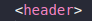 El header para el encabezado de la pagina.
- 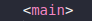 El main para el el contenido de la pagina.
- 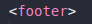 El footer para los "derechos de autor".
- 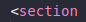 El section para dividir los diferentes contenidos de la pagina.
- 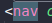 El nav para la barra de navegacion de la pagina.
- 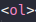 El ol para una lista ordenada de habilidades.
- 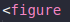 El figure para imagenes.
- 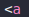 El a para enlaces.
- 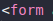 El form para el formulario de la pagina.

**Maqueta de la pagina**
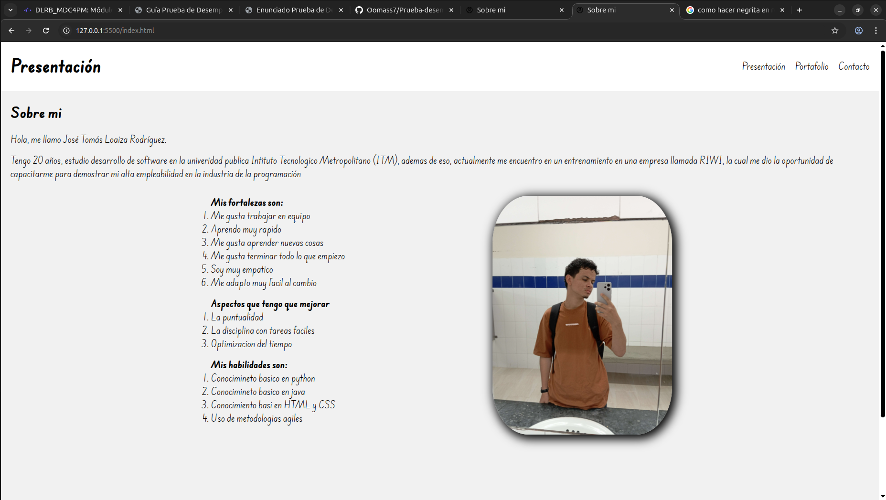
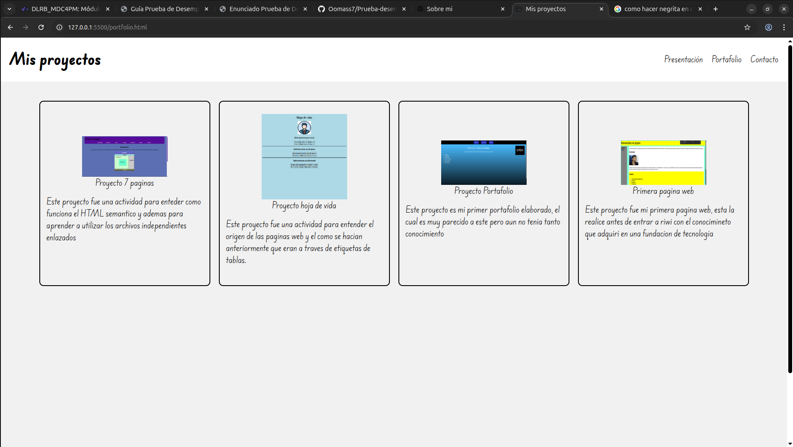
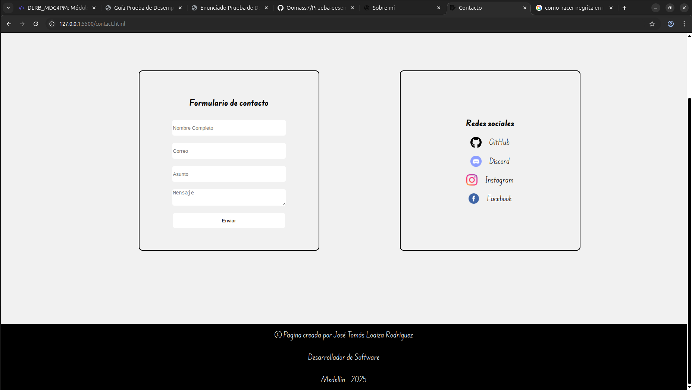

**Vista previa del codigo**
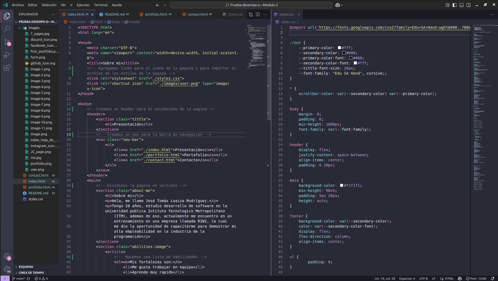